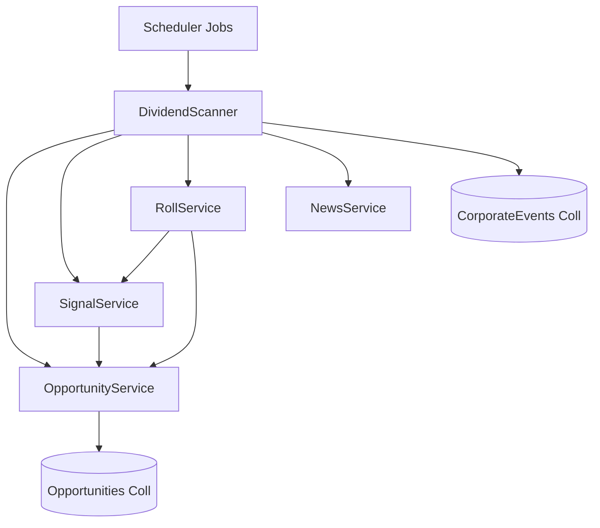

# Dependency Graph & Analysis

This document maps the module dependencies and analyzes potential bottlenecks, specifically focusing on the interaction between `DividendScanner`, `RollService`, and `SignalService`.

## Module Import Map

### Core Services

*   **`app.scheduler.jobs`**
    *   Imports: `DividendScanner`, `ExpirationScanner`, `ibkr_service`, `stock_live_comparison`.
    *   **Role**: Entry point for background tasks.

*   **`app.services.dividend_scanner`**
    *   Imports:
        *   `app.services.opportunity_service` (for `JuicyOpportunity` persistence)
        *   `app.services.signal_service` (for `SignalService` - Price Prediction)
        *   `app.services.roll_service` (for `RollService` - Option Chain data)
        *   `app.services.news_service` (for `NewsService`)
        *   `app.models.opportunity`
        *   `app.models_news` (`CorporateEvent`)

*   **`app.services.roll_service`**
    *   Imports:
        *   `app.services.signal_service` (for `SignalService` - Smart Roll signals)
        *   `app.services.opportunity_service`
    *   **Note**: Does NOT import `DividendScanner` (Avoids direct import cycle).

*   **`app.services.signal_service`**
    *   Imports:
        *   `app.services.opportunity_service`
    *   **Note**: Uses `pykalman` and `markovify` (optional).

## Interaction Analysis

### The "New Collection" Interaction
The **`corporate_events`** collection is managed exclusively by `DividendScanner`.
*   **Write**: `DividendScanner` fetches data from `yfinance` and writes to `corporate_events`.
*   **Read**: `DividendScanner` reads from `corporate_events` to generate the `.ics` calendar.
*   **Dependency**: It depends on `ibkr_holdings` (via `MongoClient`) to know which tickers to scan.

### Initialization Bottleneck & Test Failure
The failure in `tests/test_dividend_features.py` (returning empty results `0 == 1`) is likely caused by the **Initialization Chain**:

1.  **The Chain**:
    `DividendScanner()` -> instantiates `RollService()` -> instantiates `SignalService()`.

2.  **The Test Context**:
    The test mocks `SignalService` and `OpportunityService` *specifically for `DividendScanner`* via `@patch("app.services.dividend_scanner.SignalService")`.
    
    However, `DividendScanner` *also* instantiates `RollService`.
    `RollService` in turn instantiates its own `SignalService`.
    
3.  **The Failure Cause**:
    *   In the test `test_dividend_scanner`, `DividendScanner` is instantiated.
    *   It successfully mocks `self.signal_service`.
    *   But logic inside `scan_dividend_capture_opportunities` might be relying on data or behavior that is disrupted by the complex mocking setup or missing mocks for `RollService`'s internal dependencies.
    *   Specifically, if `mock_ticker.info` lacks specific fields (like `currentPrice` vs `previousClose` fallback), the scanner `continue`s silently.
    *   **CRITICAL**: The test sets `mock_ticker.info` with `dividendRate` as a raw value (e.g., `5.00`), but the code calculates yield as `(div_rate / current_price) * 100`.
    *   If `current_price` is missing or 0, it might raise an exception which is caught by the broad `except Exception` block, causing the loop to `continue` without adding opportunities.
    *   **Observation from Code**: The test mocks `mock_ticker.info` but `scan_dividend_capture_opportunities` accesses `ticker.info`. If `yf.Ticker` is mocked correctly, this works.
    *   **likely Culprit**: The `SignalService` mock returning `MagicMock` objects for `predict_future_price`. When these Mocks are passed into the `JuicyOpportunity` model (Pydantic), strict validation (if enabled) or subsequent serialization attempts might fail. If this raises an exception, the scanner logs it and returns an empty list, failing the test.

### Recommendation
To fix the test:
1.  Ensure `mock_signal_service` returns a dictionary (not a Mock) for `predict_future_price`.
2.  Ensure `mock_ticker.info` contains all required fields (`currentPrice`, `exDividendDate`, `dividendRate`).
3.  Verify that `DividendScanner` is using the *patched* classes.

## Visual Graph

